# HTML basic IV
幫我想想我可以在這邊寫甚麼  
# 擲骰子 II
ET01喜歡打日麻，每次開牌時都需要骰兩顆骰子來決定：要從誰前面的排山開始抓牌、從第幾墩抓牌  
問題來了，我們的擲骰子web只有一顆骰子，顯然我們需要寫一個可以擲兩顆骰子的web  

在這之前，我們先整理一下我們的程式碼  
我們之前將"區間亂數產生器"和"顯示骰子點數"的程式碼寫在一起，所以會很亂，現在，我們把它包成一個函數  
```js
function randomint(l,r){
	let loop=r-l+1;
	let a=Math.random();
	a*=loop;
	a+=l;
	a=Math.floor(a);
	return a;
}
function dice(){//擲骰子
	let a=randomint(1,6);
	console.log(a);//當然，可以是其他顯示點數的方式
}
```
相對的，我們的 `HTML` code 也要做相對應的修改  
```html
<button onclick="dice();">擲骰子</button>
```
那如果我想骰兩顆骰子怎麼辦？***呼叫兩次`randomint()`函式***  
```js
function dice(){
	let a=randomint(1,6);
	let b=randomint(1,6);
	console.log(a);
	console.log(b);
}
```
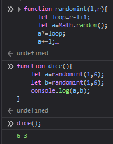  
他成功骰了兩顆骰子，接著搭配我們的 `HTML` code...  
等一下，我們的 `HTML` code 只有安排一個空間（一個`id`）來顯示，但我們有兩顆骰子  
我們要把兩個數字以字串的方式合併，變成一串字串，再把他放進`innerHTML`裡面  
終於來到今天的重點了  
# `JS` string 字串
如何宣告
```js
let a="字串";
let b='也可以用單引號';
```
# `JS` 字串的合併
把他們加起來就好了
```js
let a="a";
let b=a+a;//  b="aa"
b+="test";//  b=b+"test"	b="aatest"
```
# `JS` `String()` 數字轉字串
可以使用 `String(n)` 將數字轉成字串  
注意，這邊的 `S` 要大寫
```js
String(123);//  "123"
```

聰明的你應該知道要如何把兩顆骰子併在一起了把？
```js
function dice(){
	let a=randomint(1,6);
	let b=randomint(1,6);
	console.log(String(a)+String(b));
}
```
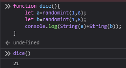  
21點，好歐  
我們應該要在兩個數字之間加個空格才對，隊把
```js
console.log(String(a)+" "+String(b));
```
同樣的概念，我們也可以用在圖片上面  
上次課程的最後，講師使用圖片來取代文字來顯示骰子點數，但當初，我暴力的使用大量的`if`來寫  
現在，我們可以改變一下寫法  
首先，先把圖片檔明改簡單一點，改成`1.png`、`2.png`...`6.png`  
（講師使用的是.svg檔，但你們不要也把副檔名也改掉，圖片會壞掉，原本是.jpg就改成`1.jpg`...）  
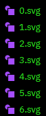  
接著撰寫顯示圖片的`HTML`程式碼  
```html

```
把它拆解成[`字串`+`數字`+`字串`]的形式  
```js
''
```
程式碼可以改寫成
```js
function dice(){
	let a=randomint(1,6);
	let b=randomint(1,6);
	let imgtxt='';
	imgtxt+='';
	document.getElementById("dice").innerHTML=imgtxt;
}
```
[sample](https://pcic35-html.github.io/class4/dice1/)  
[source](https://github.com/pcic35-html/class4/blob/main/dice1/index.html)  

# 擲骰子 III
問題又來了，我們做了可以一次骰兩顆骰子的擲骰子web，但ET01還是不滿意，他想要一次骰100顆骰子  
為甚麼呢？因為[超超超超超喜歡你的100個女朋友（君のことが大大大大大好きな100人の彼女）](https://youtube.com/playlist?list=PL12UaAf_xzfrz7SGyU-5-7E0gmcQ0mNiF)  
（這周日 `22:00` 更第十一集，誰要陪我看）  
很明顯，我們需要"迴圈"  
這邊很複雜，認真聽了歐  
```js
for(初始值;條件;更新){
	//程式碼
}
```
- `初始值`：迴圈開始前，要先做的事  
通常我們會寫`let i=0`，也就是從 `0` 開始 ~~的異世界生活~~  
- `條件`：每次迴圈開始前，都會先判斷這個條件，如果條件成立，就會執行`程式碼`，否則就會跳出迴圈  
通常我們會寫 `i<100`，也就是 `i` 會從 `0` 數到 `99` ，數到 `100` 就會跳出迴圈（因為 `100<100` 不成立）  
- `更新`：每次執行完`程式碼`後，都會執行這個更新，通常是將`初始值`更新，讓`條件`可以成立  
通常我們會寫 `i++` ，也就是說每跑完一次迴圈， `i` 就會加 `1` ，也就是 `i=0`、`i=1`、`i=2`...  
相對的，如果我們寫成 `i+=2` ，就會變成每次都會 `+2` ，變成 `i=0`、`i=2`、`i=4`...  

統整之後如下  
```js  
for(let i=0;i<100;i++){
	//程式碼
	//這邊的程式碼會被執行100次
	//可以使用i來判斷目前是第幾次迴圈
}
```
撰寫建議：可以先試著產生5顆骰子，確認沒問題後再把數字調到100  
```js
function dice(){
	document.getElementById("dice").innerHTML="";//先把上次的結果清空
	//for(let i=0;i<5;i++){  //如果還不熟悉for迴圈，可以先試著用這一行產生5顆骰子
	for(let i=0;i<100;i++){  //產生100顆骰子var，熟悉過後再把數字調大
		let a=randomint(1,6);
		let imgtxt='';
		document.getElementById("dice").innerHTML+=imgtxt;//將新的骰子加入
	}
}
```
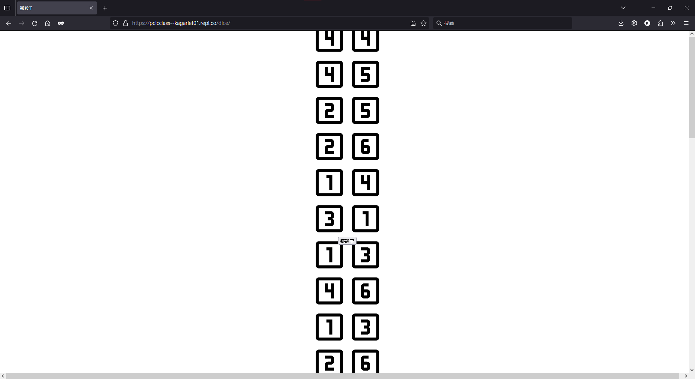  
破圖辣，大哥  
記得要修改 `HTML` 的顯示樣式  
講師的作法是將圖片size改成整個版面的`10%`，也就是`width:10%;height:10%;`  
```css
.dice_image{
	width:10%;
	height:10%;
}
```
這樣子剛好可以讓100顆骰子在一個版面內  
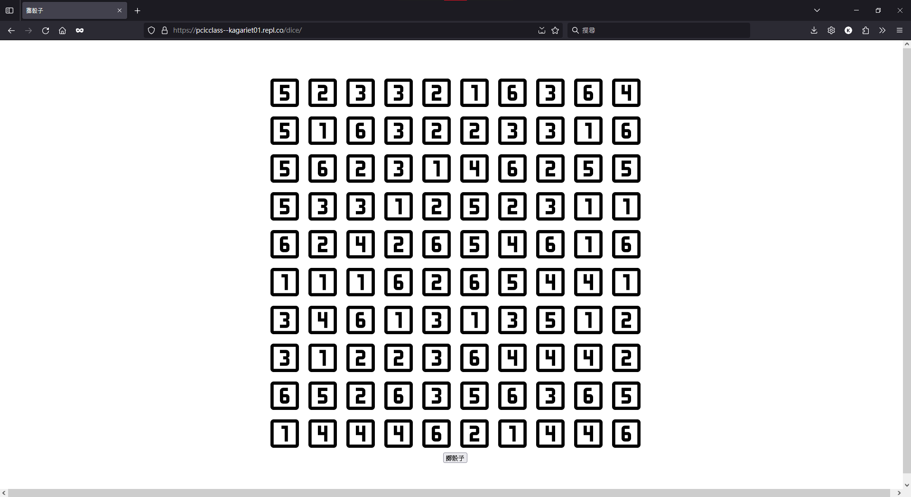  
[sample](https://pcic35-html.github.io/class4/dice100/)  
[source](https://github.com/pcic35-html/class4/blob/main/dice100/index.html)  

# 擲骰子 IV
沒錯，我們又又双双要寫擲骰子  
我們要一次擲出n顆骰子，n=使用者自行輸入  

# `HTML` `<input>` 輸入框
```html
<!--允許輸入文字，預設值為"輸入框預設值"-->
<input 
	type="text" 
	id="input" 
	value="輸入框預設值"
	onkeydown="按下按鍵時執行的函式"
>
<!--只允許輸入數字，預設值為3-->
<input type="number" id="dice_count" value="3" onkeydown="dice()">
<script>
	document.getElementById("dice_count").value;//取得輸入框的值
	//注意，後面是value，不要打成innerHTML
</script>
```
得到了使用者輸入的值後，我們就可以用`for`迴圈來產生骰子了  
```js
function dice(){
	let n=document.getElementById("dice_count").value;//取得輸入框的值
	document.getElementById("dice").innerHTML="";//先把上次的結果清空
	let str="";
	for(let i=0;i<n;i++){  //產生n顆骰子
		let a=randomint(1,6);
		let imgtxt='';
		str+=imgtxt;//將新的骰子加入
	}
	document.getElementById("dice").innerHTML=str;//更新結果
}
```
[sample](https://pcic35-html.github.io/class4/dice_pro/)  
[source](https://github.com/pcic35-html/class4/blob/main/dice_pro/index.html)  

恭喜你，完成第一個網頁小遊戲：擲骰子  

# `HTML` 嵌入內容
找尋一隻YT影片，點擊分享，應該會出現一個`嵌入`的選項  
  
他會給你一串`HTML`程式碼  
  
你可以把它貼在網頁上面  
例如，我把它貼在擲骰子網頁的下方  
```html
<body>
	<!--這上面是你擲骰子的程式碼-->
	<iframe width="560" height="315" src="https://www.youtube-nocookie.com/embed/dQw4w9WgXcQ?si=2JSCSrcjqxABg-wn" title="YouTube video player" frameborder="0" allow="accelerometer; autoplay; clipboard-write; encrypted-media; gyroscope; picture-in-picture; web-share" allowfullscreen></iframe>
</body>
```
  
你的網頁也會跟著出現辣個YT影片  
如果要在網頁上分享YT影片，這個功能會很方便  

# `JS` 自動跳轉
各位，注意聽好，這部分特別重要  
它的重要性有多高，看我朋友寫的網頁就知道了  
暴雷：<span style="background-color:#f00;color:#f00;">點進去會出現Never gonna give you up.</span>  
<https://bennydioxide.github.io>  
~~放心，他是`github`的靜態網頁({name}.github.io)，而不是(youtube.com)~~  
[source](https://github.com/BennyDioxide/bennydioxide.github.io/blob/RickRoll/index.html)  
`window.location.href`會回傳目前的網址，也就是上面辣個`https://pcicclass--kagariet01.repl.co/dice/`  
那如果把他設定成其他網址呢，他會把你帶到其他網址  
例如  
```js
window.location.href="https://www.youtube.com/watch?v=dQw4w9WgXcQ";
```
我想這功能要怎麼用 ~~，應該不用我教吧~~  
首先，先寫一個簡單的網頁  
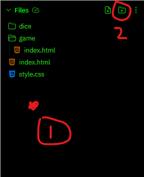  
1. 將焦點放到根目錄上（點下面的空白處）
2. 創建資料夾，名稱命名為...（自由發揮）

p.s. 如果你忘記做第一步，焦點落在資料夾上，那結果會變成在資料夾中再開一個資料夾，這不是我們想要的結果  
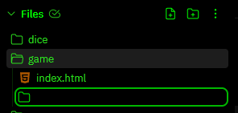  

接著，新增一個`index.html`檔案  
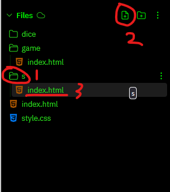  

網頁至少要包含`<title>`，其他可以不用（因為我們只是要搞人，所以不用太認真）  
p.s. 可以複製之前寫過的內容，加快網頁開發速度  
```html
<!DOCTYPE html>
<html>
	<head>
		<title>ET01的網頁</title>
	</head>
</html>
```
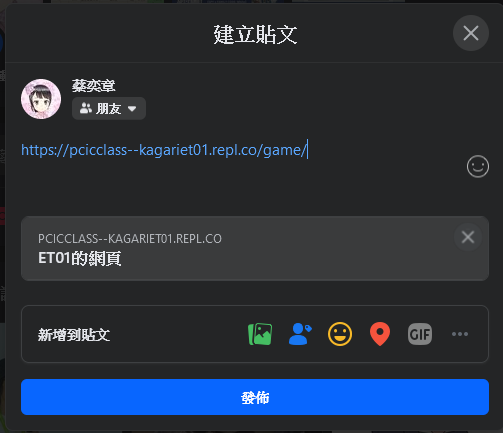  
把網址貼到FB上，看起來真是天真無邪的網頁  
接著，我們要在`<body>`裡面加入一個`<script>`  
```html
<!DOCTYPE html>
<html>
	<head>
		<title>ET01的網頁</title>
	</head>
	<body>
		<script>
			window.location.href="https://www.youtube.com/watch?v=dQw4w9WgXcQ";//  當然的，可以是其他網址
		</script>
	</body>
</html>
```
當載入網頁時，會執行指令`window.location.href="https://www.youtube.com/watch?v=dQw4w9WgXcQ";`  
將使用者跳轉到`https://www.youtube.com/watch?v=dQw4w9WgXcQ`  
然後，你的朋友就被坑了  
免責聲明：此網站請謹慎服用，若造成任何感情上的傷害，本人概不負責  
[sample](https://pcic35-html.github.io/class4/rick/)  
[source](https://github.com/pcic35-html/class4/blob/main/rick/index.html)  

# ?
為甚麼標題打`?`，因為某些網址後面會有`?`，然後後面會有一些參數 ~~好爛~~  
格式如下  
```txt
https://example.com
?
參數1=值1
&
參數2=值2
&
key=value

......

（合併成一行）
https://example.com?參數1=值1&參數2=值2&參數n=值n
```
舉個例子：`https://www.youtube.com/watch?v=dQw4w9WgXcQ`  
代表網頁是`https://www.youtube.com/watch`，後面的`v=dQw4w9WgXcQ`是參數  
在社長的網頁也能看到同樣的用法  
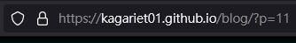  
參數`p=11`代表這是第11篇文章  
我們知道可以用`window.location.search`來取得參數，也就是`?`後面的那串東西（包含`?`）  
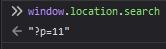  
因為這兩行指令特別相近，怕有人搞混，這邊對比一下兩者差別  
- `window.location.href` 回傳完整網址 `https://www.com/?a=1`
- `window.location.search` 只回傳參數 `?a=1`

而我們可以用`URLSearchParams()`來解析參數  
先試著用下列指令列出所有參數  
p.s. 建議直接在終端機輸入以下指令  
```js
let parameterTXT=window.location.search;//  取得參數（未解析）
let parameter=new URLSearchParams(parameterTXT);//  解析參數
//p.s. URLSearchParams() 前面要加new
console.log(parameter);//  列出所有參數
```
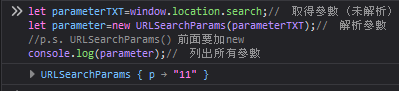  
看到最下面的`URLSearchParams { 你的參數資料 }`就代表參數解析成功  
接下來，我們要取得參數的值  
假設我們要取得`p`的值  
```js
let val_you_want=parameter.get("你想要取得的值的key，格式為字串");//  取得參數"你想要取得的值的key，格式為字串"的值
let val_p=parameter.get("p");//  取得參數"p"的值
console.log(val_p);//  列出參數"p"的值
```
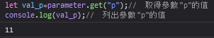  

# `JS` `dict` 字典
`dict`是一種資料結構，可以將資料以`key`和`value`的形式儲存  
我們提供`key`，就可以取得`value`  
```js
let dict={
	"key1":"value1",
	"key2":"value2"
}
//  一個字典索引格式為  "key":"value"
//  兩個字典索引之間要有逗號 ,
//  請記住：最後一個字典索引後面不要加逗號
//  不然會錯誤
//  "value"可以改為其他東西
//  例如數字 123
//  字串 "abc"
//  又或是另一個字典 {"key":"value"}

let val=dict["key1"];//  取得字典"dict"的"key1"的值
console.log(val);//  列出"key1"的值
```
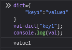  

# 自己來做短網址
分享連結時，常常遇到這種情況  
```txt
https://docs.******.***/document/d/1R******WHuMbd6xbber********p4XlsZAWQc-U2z7Q/edit*****drive_web****d***12559****3394****18
```
p.s. 網址已打碼  
特別的長  
這個時候，就要用短網址了  
然後就會得到  
```txt
https://reurl.cc/V4yGm5
```
多個短網址混在一起，很容易混亂  
如果後面的key(?)可以自行設定，就不會混亂了  
```txt
https://kagariet01.github.io/?s=rickroll
```
我們可以直接看出來：點進去就準備被瑞克搖了  
現在，我們就來做這個東西  
老樣子，先建立一個資料夾，名稱隨意，但建議短一點  
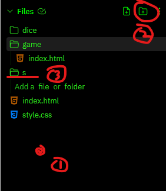  
在裡面新增`index.html`檔案  
  
因為我們只是要寫自動跳轉的網頁，所以只要寫`<script>`就好  
~~雖然沒有不行，但這樣寫有點詭譎~~
（可以視需要在`<body>`裡面寫一些說明，或者放一些連結，變成連結集中站）  
```html
<script>
	let dict={//  這個dict將存入我們短網址的key(縮寫)和value(要跳轉過去的網址)
		"g":"https://www.google.com/",
		"y":"https://www.youtube.com/",
		"rickroll":"https://www.youtube.com/watch?v=dQw4w9WgXcQ",
		"kagariet01":"https://kagariet01.github.io/about"
	}
	let parameter=new URLSearchParams(window.location.search);//  解析參數
	let val=parameter.get("s");//  取得參數"s"的值
	console.log("短網址key為"+val);//  列出參數"s"的值
	if(val!=null){//  確保參數"s"有值
		if(dict[val]!=null){//  確保dict有參數"s"的值
			window.location.href=dict[val];//  跳轉到dict的參數"s"的值
		}
	}
	console.log("跳轉失敗");
</script>
```
[sample](https://pcic35-html.github.io/class4/s)  
[source](https://github.com/pcic35-html/class4/blob/main/s/index.html)  
如果你足夠瘋狂，可以把前面的網址背起來，然後把所有你常用的網站加進`dict`裡面  


